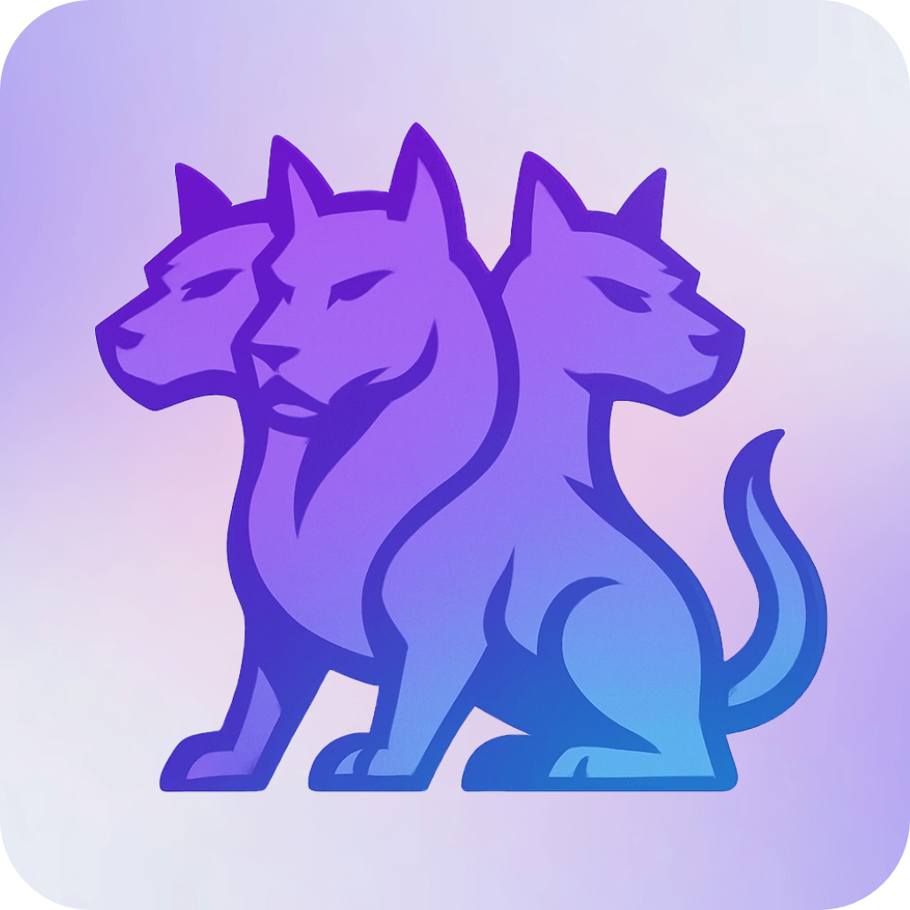

<p align="center">
  <picture>
    
  </picture>
  <br />
  <strong>Cerberus AI API</strong>
  <em> - Cybersecurity AI</em>
</p>

Backend API service for AI-powered chat with RAG (Retrieval-Augmented Generation) capabilities, compute node management, and user authentication.

## Features

- **Authentication** - JWT-based user authentication
- **RAG System** - Document embedding and retrieval for AI knowledge base
- **Compute Node Management** - Monitor and manage Ollama nodes
- **Chat API** - AI chat with context-aware responses
- **Document Processing** - PDF parsing, web crawling, markdown conversion

## Tech Stack

- **Runtime**: Node.js with TypeScript
- **Framework**: Express.js
- **Database**: PostgreSQL
- **Vector DB**: LanceDB
- **AI**: Ollama integration
- **Authentication**: JWT + bcrypt

## Prerequisites

- Node.js 18+
- PostgreSQL
- Docker (optional, for containerized deployment)

## Environment Variables

Create a `.env` file with the following variables:

| Variable | Description | Example |
|----------|-------------|---------|
| `JWT_SECRET` | Secret key for JWT tokens | `your-secret-key` |
| `CORS_URL` | Allowed CORS origin | `https://your-frontend.com` |
| `DB_HOST` | PostgreSQL host | `localhost` |
| `DB_PORT` | PostgreSQL port | `5432` |
| `DB_USER` | Database user | `cerberusai` |
| `DB_PASSWORD` | Database password | `cerberusai` |
| `DB_NAME` | Database name | `cerberusai_db` |
| `MODEL_KEEPALIVE` | Ollama model keepalive (seconds) | `300` |
| `OLLAMA_API_KEY` | Ollama API key | `your-api-key` |
| `KNOWLEDGE_UPDATE_INTERVAL` | Knowledge sync interval (ms, 0 = disabled) | `3600000` |
| `PORT` | Server port | `8080` |
| `SSL_KEY_PATH` | Path to SSL private key (optional) | `./ssl/key.pem` |
| `SSL_CERT_PATH` | Path to SSL certificate (optional) | `./ssl/cert.pem` |

## Installation

### Local Development

```bash
# Install dependencies
npm install

# Run in development mode
npm run dev

# Build for production
npm run build

# Start production server
npm start
```

### Docker Build

```bash
docker buildx build --builder mybuilder --platform linux/amd64,linux/arm64 -t username/cerberus-ai-api --push .
```

### Docker Compose

```yaml
services:
  api:
    image: sobotat/cerberus-ai-api
    container_name: cerberus-ai-api
    restart: unless-stopped
    ports:
      - "8080:8080"
    environment:
      JWT_SECRET: <strong-secret>
      CORS_URL: <url-to-ui>
      DB_HOST: <db-ip>
      DB_PORT: <db-port>
      DB_USER: cerberusai
      DB_PASSWORD: cerberusai
      DB_NAME: cerberusai_db
      MODEL_KEEPALIVE: 300
      OLLAMA_API_KEY: <ollama-api-key>
    volumes:
      - data:/app/data

volumes:
  data:
```

## API Endpoints

| Endpoint | Description                                              |
|----------|----------------------------------------------------------|
| `/auth/*` | Authentication routes (login, register, password change) |
| `/users/*` | User management                                          |
| `/compute-nodes/*` | Compute node management and Ollama models management |
| `/chats/*` | Chat operations                                          |
| `/knowledge/*` | Knowledge base management                                |

## Project Structure

```
src/
├── controllers/     # Request handlers
├── core/
│   ├── init/       # Initialization logic
│   └── rag/        # RAG system components
├── middleware/      # Express middleware
├── routes/          # API route definitions
└── types/           # TypeScript type definitions
```

## License

Private project — Master's thesis.